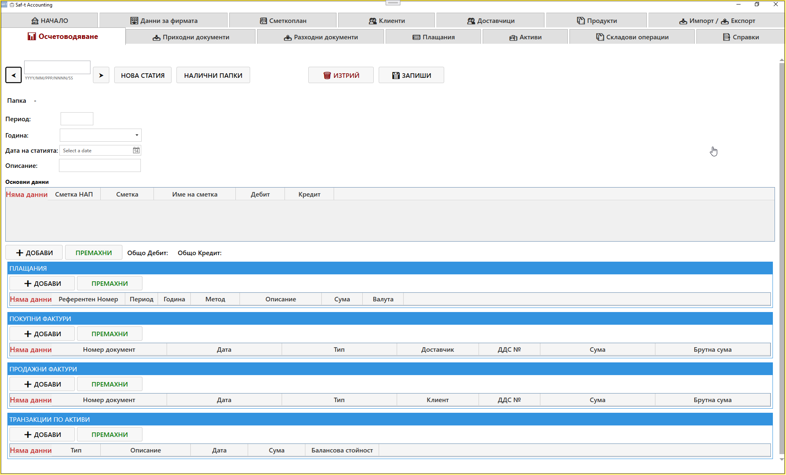
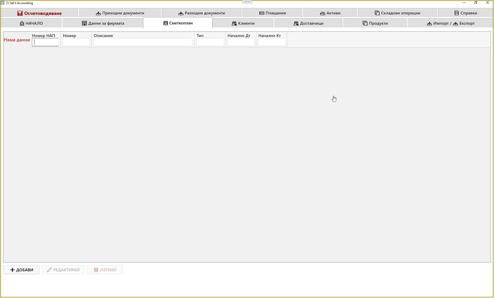
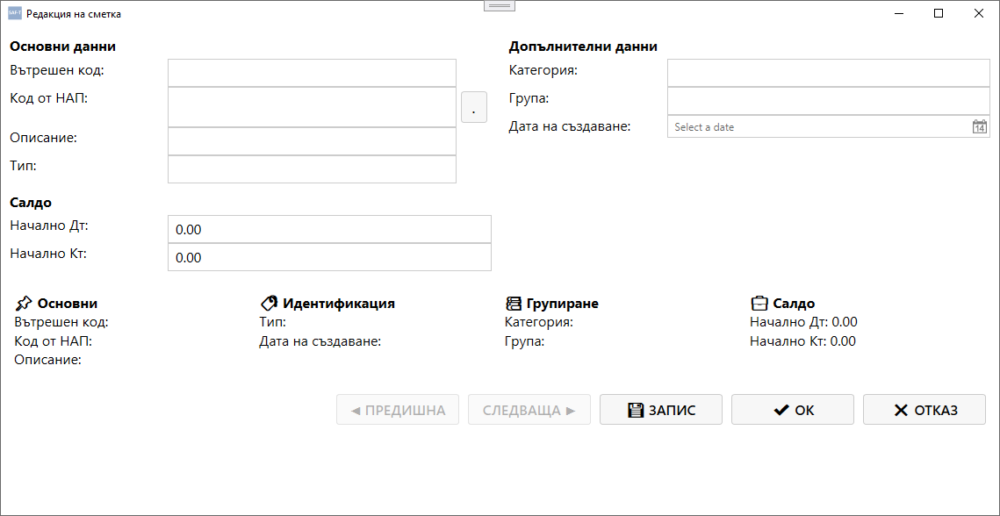
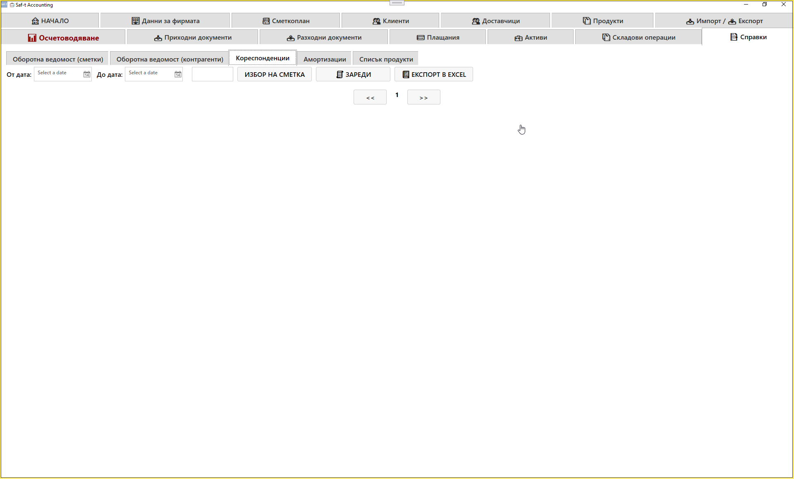

# Таб: Осчетоводяване

Табът **Осчетоводяване** е централният модул на SAFTViewer, който обединява всички счетоводни операции в един екран.  
Тук се създават, редактират и записват счетоводни статии, както и свързаните с тях плащания, фактури и активи.

---

## 🧭 Навигация и контекст

Табът **Осчетоводяване** е достъпен директно от главния екран като отделен модул.  
Той е визуално отличен с различен цвят, за да подчертае значението му като основен център на счетоводната работа.

---

## 🧩 Основна структура

Екранът е разделен на няколко секции:

### **1. Основни данни**
Тази секция съдържа основната таблица на счетоводната статия.

| Колона | Описание |
|--------|-----------|
| **Сметка НАП** | Код на сметката според НАП |
| **Сметка** | Вътрешен счетоводен номер |
| **Име на сметка** | Наименование на сметката |
| **Дебит** | Сума по дебит |
| **Кредит** | Сума по кредит |

Под таблицата има бутони:
- **➕ Добави** – добавя нов ред към статията  
- **🗑️ Премахни** – изтрива избран ред  
- **Общо Дебит / Общо Кредит** – показва сборовете по статията

---

### **2. Плащания**
Секцията показва всички плащания, свързани със статията.

| Колона | Описание |
|--------|-----------|
| **Референтен номер** | Уникален идентификатор на плащането |
| **Период / Година** | Отчетен период |
| **Метод** | Начин на плащане (банков, касов и др.) |
| **Описание** | Кратко описание |
| **Сума / Валута** | Платена сума и валута |

Бутони: **Добави**, **Редактирай**, **Премахни**

---

### **3. Покупни фактури**
Секцията съдържа всички фактури за покупки, свързани със статията.

| Колона | Описание |
|--------|-----------|
| **Номер документ** | Номер на фактурата |
| **Дата** | Дата на издаване |
| **Тип** | Вид документ |
| **Доставчик** | Име на доставчика |
| **ДДС №** | VAT номер |
| **Сума / Брутна сума** | Нетна и брутна стойност |

Бутони: **Добави**, **Редактирай**, **Премахни**

---

### **4. Продажни фактури**
Секцията съдържа всички фактури за продажби, свързани със статията.

| Колона | Описание |
|--------|-----------|
| **Номер документ** | Номер на фактурата |
| **Дата** | Дата на издаване |
| **Тип** | Вид документ |
| **Клиент** | Име на клиента |
| **ДДС №** | VAT номер |
| **Сума / Брутна сума** | Нетна и брутна стойност |

Бутони: **Добави**, **Редактирай**, **Премахни**

---

### **5. Транзакции по активи**
Секцията показва движенията по активи, свързани със статията.

| Колона | Описание |
|--------|-----------|
| **Тип** | Вид транзакция |
| **Описание** | Кратко описание |
| **Дата** | Дата на операцията |
| **Сума** | Стойност на транзакцията |
| **Балансова стойност** | Остатъчна стойност на актива |

Бутони: **Добави**, **Премахни**

---

## ⚙️ Основни действия

В горната част на екрана се намират глобалните команди:

- **Нова статия** – създава нова счетоводна статия  
- **Налични папки** – показва списък с вече създадени статии  
- **Изтрий** – премахва текущата статия  
- **Запиши** – записва всички промени  

Допълнителни полета:
- **Папка** – идентификатор на статията  
- **Период / Година** – отчетен период  
- **Дата на статията** – дата на операцията  
- **Описание** – кратко описание на статията

---

## 📌 Обобщение

Табът **Осчетоводяване** е най‑важният модул в SAFTViewer.  
Той обединява всички счетоводни операции в един екран и осигурява:

- централизирано управление на статии, плащания и фактури  
- пълна видимост върху дебит и кредит  
- връзка между активи, покупки и продажби  
- бърз достъп до всички счетоводни данни на фирмата

Това е сърцето на счетоводната система SAFTViewer.
