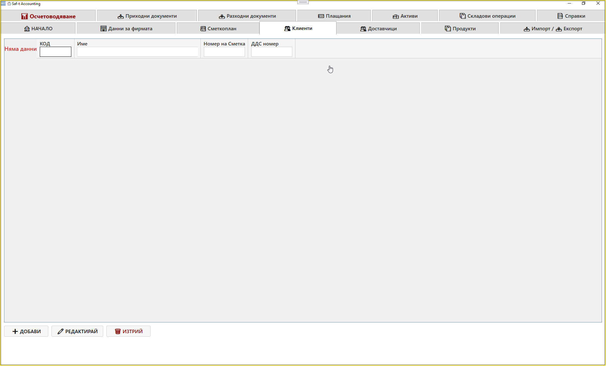
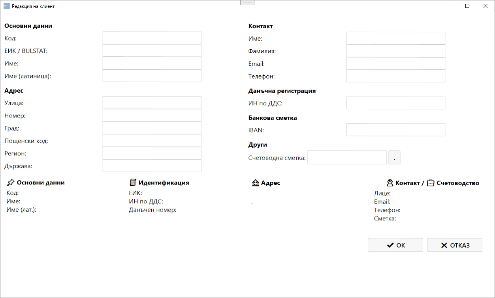

# Таб: Клиенти

Табът **Клиенти** служи за управление на всички клиенти на фирмата.  
Тук се въвеждат, редактират и изтриват записи за контрагенти, които получават фактури, плащания или други документи.

### 📸 Screenshot — Списък клиенти
{.zoomable}

### 📸 Screenshot — Редакция на клиент
{.zoomable}

---

## 🧭 Навигация и контекст

Табът **Клиенти** е достъпен като отделен модул от главния екран на Saf‑t Accounting.  
Той съдържа таблица с всички клиенти, регистрирани в системата.

---

## 🧩 Основна структура

Екранът съдържа таблица със следните колони:

| Колона | Описание |
|--------|-----------|
| **Код** | Уникален идентификатор на клиента |
| **Име** | Наименование на клиента |
| **Номер на сметка** | Счетоводна сметка, свързана с клиента |
| **ДДС номер** | VAT номер на клиента |

---

## ⚙️ Основни действия

В долната част на екрана се намират основните команди:

- **➕ Добави** – създава нов запис за клиент  
- **✏️ Редактирай** – отваря избрания клиент за корекция  
- **🗑️ Изтрий** – премахва избрания клиент от базата  

---

## 🔄 Логика на работа

1. При натискане на **Добави** се отваря форма за въвеждане на нов клиент  
2. Попълват се данните за код, име, сметка и ДДС номер  
3. След запис клиентът се появява в таблицата  
4. При нужда може да се редактира или изтрие  
5. Клиентите се използват при създаване на приходни документи и плащания

---

## 🧮 Връзка с други модули

- **Приходни документи** – използва клиентите при издаване на фактури  
- **Плащания** – свързва плащанията с конкретен клиент  
- **Справки** – показва оборотите и салдата по клиенти  
- **Импорт / Експорт** – позволява експортиране на клиентски данни към Excel или SAF‑T формат

---

## 📌 Обобщение

Табът **Клиенти** осигурява централизирано управление на всички контрагенти, които получават фактури и плащания.  
Той предоставя:

- лесно добавяне и редактиране на клиенти  
- връзка със счетоводните сметки  
- интеграция с приходни документи и справки  

Това е основен модул за работа с клиенти в Saf‑t Accounting.
