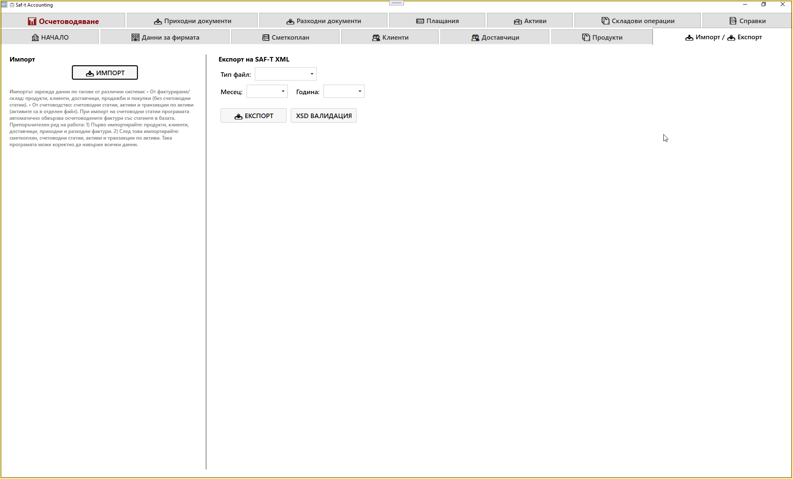
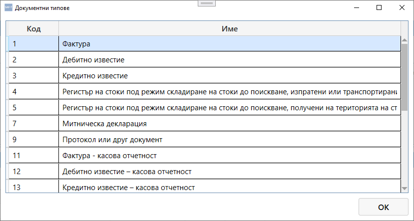

# Таб: Импорт / Експорт

Табът **Импорт / Експорт** служи за обмен на данни между SAFTViewer и външни системи чрез SAF‑T XML файлове.  
Тук се извършва зареждане (импорт) на данни от други програми и експортиране на данни към SAF‑T формат, съвместим с изискванията на НАП.

---

## 🧭 Навигация и контекст

Табът е разделен на две основни секции:

1. **Импорт** – зареждане на данни от SAF‑T XML файлове.  
2. **Експорт на SAF‑T XML** – генериране на SAF‑T файл за подаване към НАП.

---

## 📥 Импорт

Импортът зарежда данни по тагове от различни системи:

- **От фактуриране / склад:** продукти, клиенти, доставчици, продажби и покупки (без счетоводни статии).  
- **От счетоводство:** счетоводни статии, активи и транзакции по активи (активите са в отделен файл).

При импорт на счетоводни статии програмата автоматично обвързва счетоводните фактури със статиите в базата.

---

### ⚙️ Препоръчителен ред на работа

1. Импортирай първо: **продукти, клиенти, доставчици, приходни и разходни фактури.**  
2. След това импортирай: **сметкоплан, счетоводни статии, активи и транзакции по активи.**

Така програмата може коректно да навърже всички данни.

---

### 🧩 Структура на импортния файл

Импортният файл трябва да спазва **структурата на SAF‑T**, чиято спецификация може да се изтегли от сайта на НАП.  
Най‑важната част е секцията **`<Header>`**, която съдържа идентификационните данни на фирмата.

#### Критично поле:
- **ИН на фирмата (TaxRegistrationNumber)** – използва се за проверка дали фирмата в която се налива файлът, съвпада с тази в базата.

Ако ИН не съвпада, програмата няма да приеме целия файл, а само отделни секции (например само „Разходни документи“, само „Сметкоплан“ или само „Плащания“).

---

### 🧠 Гъвкавост на импортния файл

Файлът може да бъде **по‑свободен** от официалния SAF‑T формат, подаван към НАП:

- Може да съдържа **липсващи тагове** – програмата ще налее само тези, които присъстват.  
- Може да включва **частични секции** – например само фактури или само активи.  
- Програмата автоматично разпознава наличните секции и ги импортира коректно.

---

### 🔘 Бутон „ИМПОРТ“

При натискане на бутона **„ИМПОРТ“** се отваря диалог за избор на XML файл.  
След потвърждение програмата анализира структурата и зарежда данните в съответните таблици.

---

## 📤 Експорт на SAF‑T XML

Секцията **Експорт** генерира SAF‑T XML файл, съвместим с изискванията на НАП.

| Поле | Описание |
|------|-----------|
| **Тип файл** | Избор на вид отчет (например GeneralLedger, SourceDocuments и др.) |
| **Месец / Година** | Период, за който се генерира файлът |

Бутони:
- **ЕКСПОРТ** – създава SAF‑T XML файл за избрания период.  
- **XSD ВАЛИДАЦИЯ** – проверява файла спрямо официалната XSD схема на НАП.

---

## 📌 Обобщение

Табът **Импорт / Експорт** е основният инструмент за обмен на данни между SAFTViewer и външни системи.  
Той осигурява:

- коректно зареждане на SAF‑T данни от други програми  
- автоматично свързване на счетоводни статии и документи  
- гъвкав импорт с частични или непълни файлове  
- експортиране на SAF‑T XML за подаване към НАП  
- XSD валидация за проверка на структурата

Това е ключов модул за интеграция и отчетност в SAFTViewer.

