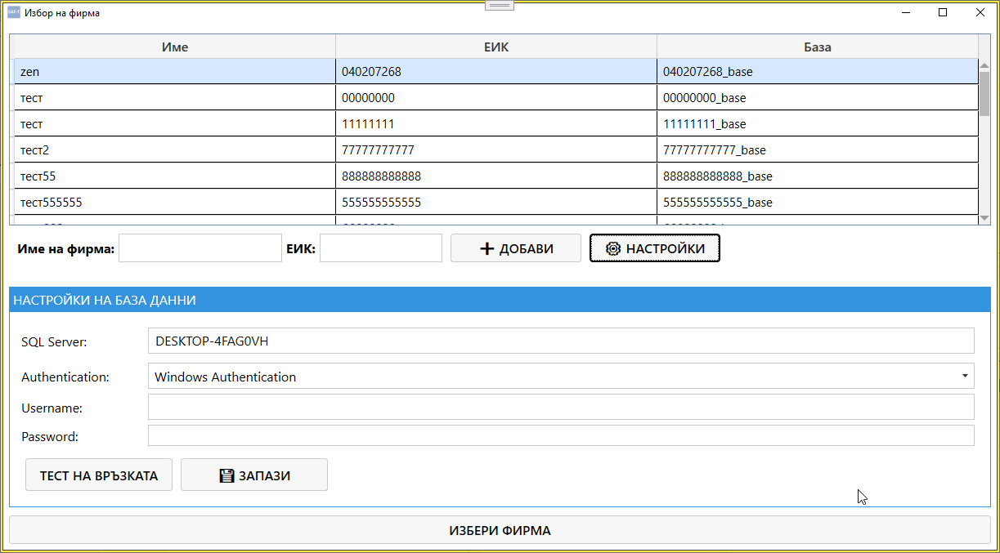
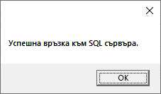

# Saf‑t Accounting User Guide

Saf‑t Accounting е настолно приложение за визуализация, анализ и проверка на SAF‑T данни.  
Документацията описва всички основни екрани, справки и функционалности на системата.

---

## 🏁 Начален екран — Избор на фирма

След стартиране на Saf‑t Accounting първият прозорец показва списък с фирмите, които имат конфигурирана база данни.

### Основни елементи

- **Списък с фирми** – име, ЕИК и име на база.
- **Добавяне на фирма** – полета за въвеждане на нова фирма.
- **Избор на фирма** – зарежда съответната база и преминава към основния екран.
- **Настройки** – отваря конфигурацията за SQL връзка.

### 📸 Screenshot — Избор на фирма
{.zoomable}

---

## ⚙ SQL настройки

При натискане на бутона **Настройки** се показва панел за конфигуриране на връзката към SQL сървъра:

- SQL Server адрес  
- Authentication (Windows / SQL)  
- Потребител / Парола  
- Тест на връзката  
- Записване на настройките  

Това позволява работа с множество фирми, всяка със собствена база.

### 📸 Screenshot — SQL настройки
{.zoomable}

---

## 🧭 Главен екран след избор на фирма

След избор на фирма Saf‑t Accounting зарежда основния работен прозорец.  
Той представлява централната навигация на системата.

### Основни секции

- **Осчетоводяване**
- **Приходни документи**
- **Разходни документи**
- **Плащания**
- **Активи**
- **Складови операции**
- **Справки**
- **Данни за фирмата**
- **Сметкоплан**
- **Клиенти**
- **Доставчици**
- **Продукти**
- **Импорт / Експорт**

### Централни функции

- **Списък фирми** – връща към началния екран.
- **Обновяване на справочници от НАП** – зарежда актуални данни.
- **Година** – показва активната счетоводна година.
- **Генерирай начални салда** – създава начални салда за нов период.
- **Изтрий началните салда** – премахва ги при нужда.
- **Последно действие** – показва лог на последната операция.

### 📸 Screenshot — Главен екран
{.zoomable}

---

## 📌 Как да използвате документацията

В менюто отляво ще намерите:

- описание на основните екрани  
- детайлни справки  
- функционалности на всеки модул  
- инструкции за импорт, експорт и настройки  

Документацията се разширява постепенно и включва всички екрани на Saf‑t Accounting.
