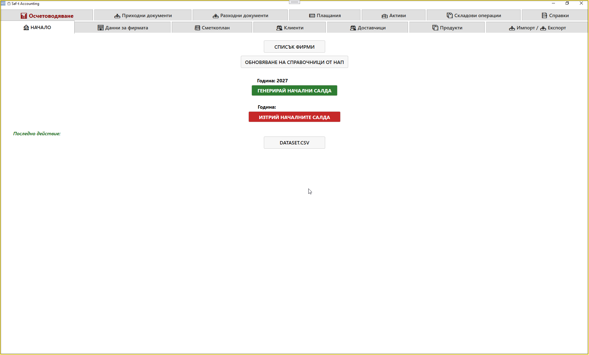

# Главен екран (Main Window)

След избор на фирма Saf‑t Accounting зарежда основния работен прозорец.  
Това е централният хъб на системата, от който потребителят навигира към всички модули, справки и операции.

### 📸 Screenshot — Главен екран

---

## 🧭 Навигационна лента (Основни модули)

Горната част на екрана съдържа навигационна лента с основните функционални секции:

- **Осчетоводяване**  
- **Приходни документи**  
- **Разходни документи**  
- **Плащания**  
- **Активи**  
- **Складови операции**  
- **Справки**  
- **Данни за фирмата**  
- **Сметкоплан**  
- **Клиенти**  
- **Доставчици**  
- **Продукти**  
- **Импорт / Експорт**

Всяка секция представлява отделен модул, който работи върху активната фирмена база.

---

## 🏢 Информация за активната фирма

В горната част на екрана се визуализира:

- името на фирмата  
- активната счетоводна година  
- текущият модул (в червено)  

Това позволява на потребителя да знае в коя база и година работи.

---

## 🧩 Централни функции

В средната част на екрана се намират основните операции, свързани с инициализацията на фирмената база.

### **Списък фирми**
Връща към началния екран за избор на фирма.

### **Обновяване на справочници от НАП**
Зарежда актуални публични справочници, като:

- кодове  
- контрагенти  
- сметкоплан  
- други данни, използвани от НАП  

Тази операция гарантира, че системата работи с най‑новата информация.

---

## 📅 Управление на счетоводната година

### **Година: 20XX**
Показва активната счетоводна година за текущата фирма.

### **Генерирай начални салда**
Създава началните салда за новата година на база данните от предходната година.

### **Изтрий началните салда**
Премахва началните салда, ако е необходимо повторно генериране или корекция.

---

## 📝 Последно действие

В долната част на екрана се показва лог на последната извършена операция.  
Това помага при проследяване на действията и диагностика.

---

## 🔄 Логика на работа

Главният екран е централната точка на Saf‑t Accounting.  
След избор на фирма системата:

1. Зарежда фирмената база.  
2. Инициализира справочниците.  
3. Показва активната година.  
4. Позволява навигация към всички модули.  

Оттук започва работата по документи, справки, осчетоводяване и анализ.

---

## 📌 Обобщение

Главният екран предоставя:

- навигация към всички модули  
- управление на счетоводната година  
- обновяване на справочници  
- връзка към списъка с фирми  
- визуализация на текущия контекст  

Това е основният контролен панел на Saf‑t Accounting.
