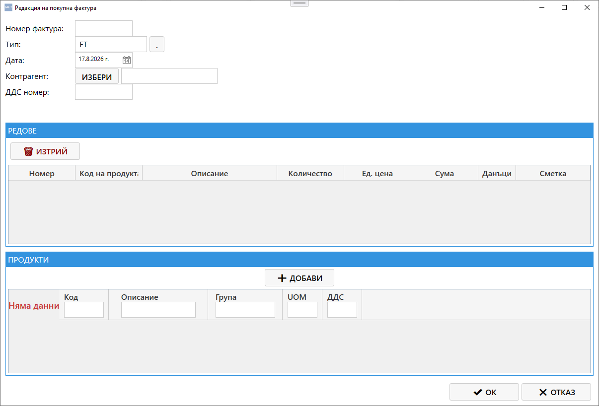

# Екран: Редакция на разходен документ (Покупна фактура)

Екранът **„Редакция на разходен документ“** позволява преглед и промяна на данните за конкретна покупна фактура от таба **„Разходни документи“**.  
Той е идентичен по структура с екрана за приходни документи, но е ориентиран към доставчици и покупки.{.zoomable}
---

## 🧭 Навигация и контекст

Екранът се отваря при избор на команда **„Редактирай“** от таба **Разходни документи**.  
Позволява редакция на вече съществуваща фактура или преглед на нейните данни.

---

## 🧩 Основна структура

### **1. Основни данни**

| Поле | Описание |
|------|-----------|
| **Номер фактура** | Уникален номер на документа |
| **Тип** | Код на типа документ (напр. 01 – покупна фактура, 02 – дебитно известие) |
| **Дата** | Дата на издаване |
| **Доставчик** | Контрагент, от когото е получена фактурата |
| **ДДС номер** | VAT номер на доставчика |

---

### **2. Редове**

| Колона | Описание |
|---------|-----------|
| **Номер** | Пореден номер на реда |
| **Код** | Код на продукта или услугата |
| **Описание** | Наименование на продукта или услугата |
| **Количество** | Брой или количество |
| **Ед. цена** | Единична цена |
| **Сума** | Обща сума за реда |
| **Данъци** | Приложен данък (ДДС, акциз и др.) |
| **Сметка** | Счетоводна сметка, към която се осчетоводява редът |

**Бутони:**
- **🗑️ Изтрий** – премахва избрания ред от фактурата.

---

### **3. Продукти**

| Колона | Описание |
|---------|-----------|
| **Код** | Код на продукта |
| **Описание** | Наименование |
| **Група** | Категория (стока, услуга и др.) |
| **UOM** | Мерна единица |
| **ДДС** | Процент на данъка |

**Бутони:**
- **➕ Добави** – добавя избрания продукт като нов ред във фактурата.

---

## ⚙️ Основни действия

| Бутон | Действие |
|-------|-----------|
| **✔ ОК** | Потвърждава редакцията и затваря прозореца |
| **✖ Отказ** | Отменя промените и затваря прозореца |

---

## 🔄 Логика на работа

1. При отваряне на екрана се зареждат текущите данни за избраната фактура.  
2. Потребителят може да редактира основните полета, редовете и продуктите.  
3. При натискане на **ОК** промените се съхраняват в базата данни.  
4. При **Отказ** промените се игнорират.  
5. Данните се обновяват автоматично в таба **Разходни документи**.

---

## 📌 Обобщение

Екранът **„Редакция на разходен документ“** е основният инструмент за управление на покупните фактури в Saf‑t Accounting.  
Той осигурява:

- пълен контрол върху редовете и продуктите  
- автоматично изчисляване на суми и данъци  
- връзка със счетоводните сметки  
- интеграция с модулите „Доставчици“, „Плащания“ и „Справки“  

Това е ключов вътрешен екран за управление на разход
