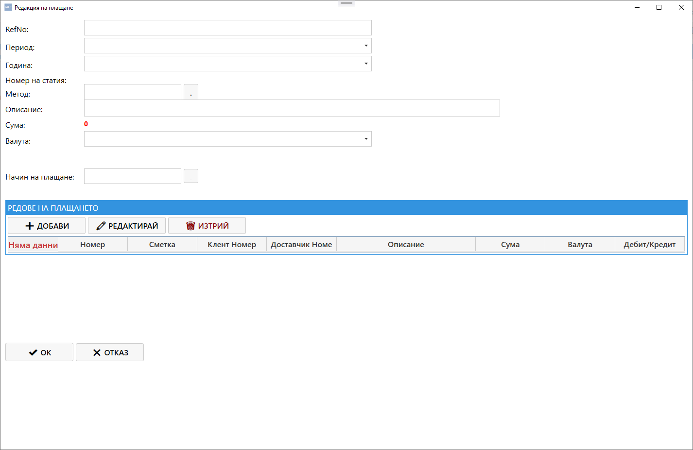

# Екран: Редакция на плащане

Екранът **„Редакция на плащане“** позволява преглед и промяна на данните за конкретно плащане от таба **„Плащания“**.  
Той съдържа всички основни параметри, редове и счетоводни връзки, необходими за правилното осчетоводяване и SAF‑T класификация.{.zoomable}
---

## 🧭 Навигация и контекст

Екранът се отваря при избор на команда **„Редактирай“** от таба **Плащания**.  
Позволява редакция на вече съществуващо плащане или преглед на неговите данни.

---

## 🧩 Основна структура

### **1. Основни данни**

| Поле | Описание |
|------|-----------|
| **RefNo** | Уникален референтен номер на плащането |
| **Период** | Месец или отчетен период, към който принадлежи плащането |
| **Година** | Отчетна година |
| **Номер на статия** | Връзка към счетоводната статия, в която е включено плащането |
| **Метод** | Код на метода на плащане (напр. банков превод, каса, ваучер и др.) |
| **Описание** | Кратко описание на плащането |
| **Сума** | Общата сума на плащането |
| **Валута** | Валутата, в която е извършено плащането |
| **Начин на плащане** | Код, определящ начина на плащане (например 99 – други) |

---

### **2. Редове на плащането**

Тази секция съдържа таблица с всички редове, включени в плащането.

| Колона | Описание |
|---------|-----------|
| **Номер** | Пореден номер на реда |
| **Сметка** | Счетоводна сметка, към която се осчетоводява редът |
| **Клиент номер** | Идентификатор на клиента (ако е приложимо) |
| **Доставчик номер** | Идентификатор на доставчика (ако е приложимо) |
| **Описание** | Наименование или пояснение за реда |
| **Сума** | Сума по реда |
| **Валута** | Валутата на реда |
| **Дебит / Кредит** | Посока на движението (Д – дебит, К – кредит) |

**Бутони:**
- **➕ Добави** – добавя нов ред към плащането.  
- **✏️ Редактирай** – отваря избрания ред за корекция.  
- **🗑️ Изтрий** – премахва избрания ред от таблицата.

---

## ⚙️ Основни действия

В долната част на екрана се намират командните бутони:

| Бутон | Действие |
|-------|-----------|
| **✔ ОК** | Потвърждава редакцията и затваря прозореца |
| **✖ Отказ** | Отменя промените и затваря прозореца |

---

## 🔄 Логика на работа

1. При отваряне на екрана се зареждат текущите данни за избраното плащане.  
2. Потребителят може да редактира основните полета и редовете на плащането.  
3. При натискане на **ОК** промените се съхраняват в базата данни.  
4. При **Отказ** промените се игнорират.  
5. Данните се обновяват автоматично в таба **Плащания**.  
6. Ако плащането е свързано със счетоводна статия, системата автоматично актуализира съответните записи.

---

## 📌 Обобщение

Екранът **„Редакция на плащане“** е основният инструмент за управление на плащанията в Saf‑t Accounting.  
Той осигурява:

- пълен контрол върху редовете и сумите на плащането  
- автоматична връзка със счетоводните статии  
- визуално групиране на информацията  
- интеграция с модулите „Клиенти“, „Доставчици“ и „Документи“  

Това е ключов вътрешен екран за управление на финансовите транзакции в системата.
