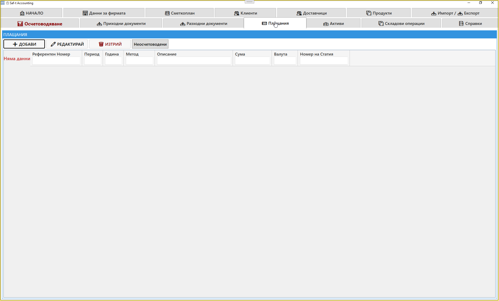
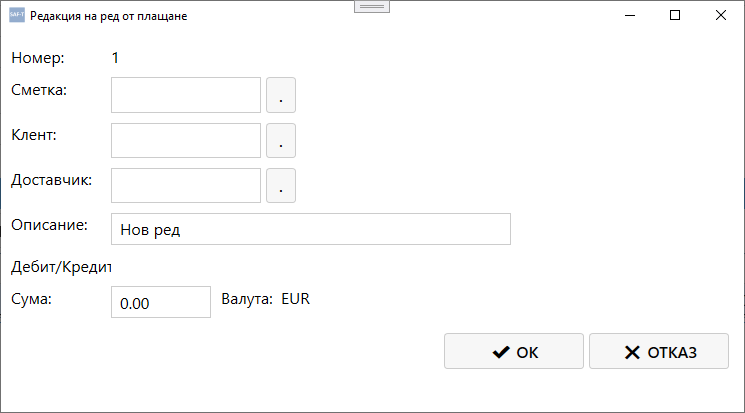
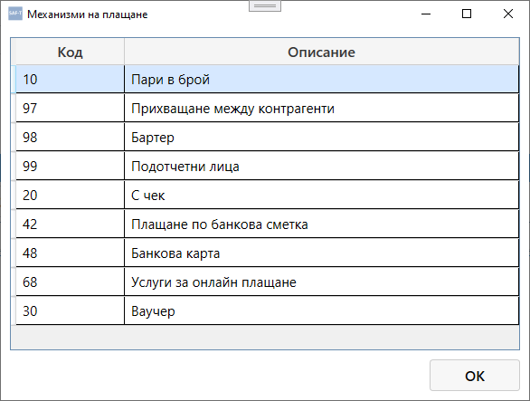
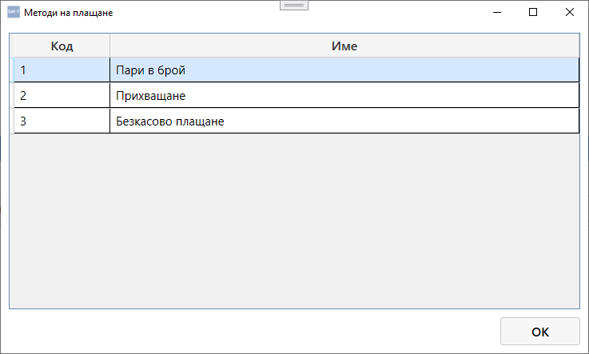

# Модул: Плащания

Модулът **Плащания** служи за управление на всички извършени и получени плащания, свързани с приходни и разходни документи.  
Тук се въвеждат, редактират и осчетоводяват операции по банкови преводи, касови плащания и други финансови транзакции.

### 📸 Screenshot — Списък плащания
{.zoomable}

### 📸 Screenshot — Редакция на плащане (част 1)
{.zoomable}

### 📸 Screenshot — Редакция на плащане (част 2)
{.zoomable}

### 📸 Screenshot — Механизъм на плащане
{.zoomable}

### 📸 Screenshot — Метод на плащане
{.zoomable}

---

## 🧭 Навигация и контекст

Модулът **Плащания** е достъпен като отделен таб от главния екран на Saf‑t Accounting.  
След отваряне се зарежда списъкът с всички плащания за избраната фирма и година.

---

## 📋 Основни бутони

В горната част на екрана се намират основните команди:

- **➕ Добави** – създава нов запис за плащане  
- **✏️ Редактирай** – отваря избраното плащане за корекция  
- **🗑️ Изтрий** – премахва избраното плащане от базата  
- **Неосчетоводени** – показва само плащанията, които все още не са осчетоводени

---

## 🧾 Таблица с плащания

Под бутоните се намира таблица, която съдържа всички плащания.

### Колони в таблицата

| Колона | Описание |
|--------|-----------|
| **Референтен номер** | Уникален идентификатор на плащането |
| **Период** | Месец или отчетен период |
| **Година** | Счетоводна година |
| **Метод** | Начин на плащане (банков превод, каса, POS и др.) |
| **Описание** | Кратко описание на операцията |
| **Сума** | Платена сума |
| **Валута** | Валутата на плащането |
| **Номер на статия** | Номер на счетоводната статия, ако плащането е осчетоводено |

Ако няма данни, се показва съобщение **„Няма данни“**.

---

## ⚙️ Логика на работа

1. При натискане на **Добави** се отваря форма за въвеждане на ново плащане  
2. След запис плащането се появява в таблицата  
3. При нужда може да се редактира или изтрие  
4. Осчетоводяването се извършва автоматично или ръчно, според настройките на фирмата  
5. Филтърът **Неосчетоводени** позволява бързо откриване на плащания, които чакат осчетоводяване

---

## 🧮 Връзка с други модули

- **Приходни документи** – свързва плащанията по продажби  
- **Разходни документи** – свързва плащанията по покупки  
- **Сметкоплан** – определя счетоводните сметки за осчетоводяване  
- **Справки** – показва отчетите за плащания и парични потоци  
- **Импорт / Експорт** – позволява експортиране на данни към Excel или SAF‑T формат

---

## 📌 Обобщение

Модулът **Плащания** осигурява пълен контрол върху финансовите транзакции на фирмата.  
Той позволява:

- централизирано въвеждане на плащания  
- връзка с приходни и разходни документи  
- автоматично осчетоводяване  
- анализ на паричните потоци  

Това е ключов модул за ежедневната финансова работа в Saf‑t Accounting.
