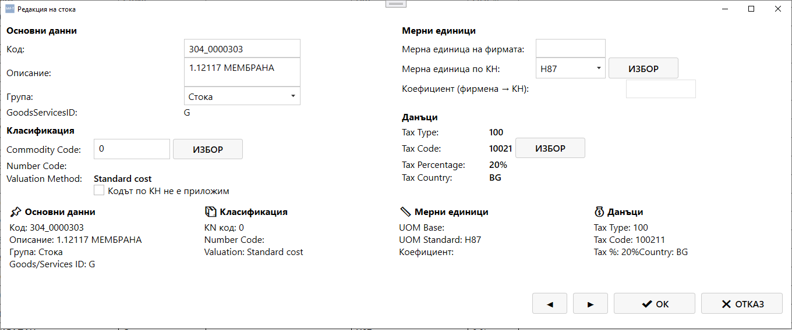

# Екран: Редакция на стока

Екранът **„Редакция на стока“** позволява преглед и промяна на данните за конкретен продукт или услуга от таба **„Продукти“**.  
Той съдържа всички основни, класификационни, данъчни и мерни параметри, необходими за правилното осчетоводяване и SAF‑T класификация.

---

## 🧭 Навигация и контекст

Екранът се отваря при избор на команда **„Редактирай“** от таба **Продукти**.  
Позволява редакция на вече съществуваща стока или услуга, както и преглед на нейните данни.

---

## 🧩 Основна структура

Екранът е разделен на левия и десния панел, като долу са поставени резюме секции.

### **Ляв панел — Основни данни и Класификация**

#### Основни данни

| Поле | Описание |
|------|----------|
| **Код** | Уникален идентификатор на продукта |
| **Описание** | Наименование на продукта или услугата |
| **Група** | Категория (напр. Стока, услуга, актив) |
| **GoodsServicesID** | Тип артикула (G – стока, S – услуга) |

#### Класификация

| Поле | Описание |
|------|----------|
| **Commodity Code** | Код по митническата номенклатура (КН) |
| **Number Code** | Вътрешен код за класификация |
| **Valuation Method** | Метод за оценка (напр. Standard cost) |
| **Checkbox** | Опция „Кодът по КН не е приложим" за специфични артикули |

### **Десен панел — Мерни единици и Данъци**

#### Мерни единици

| Поле | Описание |
|------|----------|
| **Мерна единица на фирма** | Единица мярка, използвана вътрешно |
| **Мерна единица по КН** | Единица мярка според митническата номенклатура |
| **Коефициент (фирма → КН)** | Конверсионен коефициент между единиците |
| **ИЗБОР** | Бутон за избор на единица по КН |

#### Данъци

| Поле | Описание |
|------|----------|
| **Tax Type** | Тип данък (напр. 100 за ДДС) |
| **Tax Code** | Код на данъка (напр. 10021) |
| **Tax Percentage** | Процент на данъка (напр. 20%) |
| **Tax Country** | Код на държавата (БГ за България) |
| **ИЗБОР** | Бутон за избор на данъчния код |

---

## 📋 Резюме секции (долна част)

В долната част на екрана са показани резюме панели с обобщена информация:

| Секция | Съдържание |
|--------|-------------|
| **Основни данни** | Код, описание, група, Goods/Services ID |
| **Класификация** | КН код, Number Code, Валуационен метод |
| **Мерни единици** | UOM Base, UOM Standard, Коефициент |
| **Данъци** | Tax Type, Tax Code, процент и държава |

---

## ⚙️ Действия и бутони

В крайния десен ъгъл на екрана се намират бутоните:

| Бутон | Действие |
|-------|----------|
| **◄** | Предишен продукт |
| **►** | Следващ продукт |
| **✔ ОК** | Потвърждава промените и затваря прозореца |
| **✖ ОТКАЗ** | Отменя промените и затваря прозореца |

---

## 🔄 Работен процес

1. При отваряне на екрана се зареждат данните за избрания продукт.
2. Потребителят редактира необходимите полета: код, описание, мерни единици, данъчни параметри и класификация.
3. Бутоните **◄** и **►** позволяват навигация между продуктите без затваряне на екрана.
4. При **ОК** промените се съхраняват в базата данни.
5. При **ОТКАЗ** промените се игнорират.
6. Резюме панелите вдолу показват компилираната информация във всяко време.

---

## 📌 Обобщение

Екранът **„Редакция на стока\"** е централното място за управление на продуктовите параметри в SAFTViewer.  
Той позволява:

- редакция на основни данни (код, описание, група)
- настройване на классификационни параметри (КН код, Number Code)
- дефиниране на мерни единици и конверсионни коефициенти
- конфигуриране на данъчни параметри
- навигация между продуктите с бутоните ◄ и ►

✔ Резюме панелите дават бърз преглед на всички параметри на продукта.
