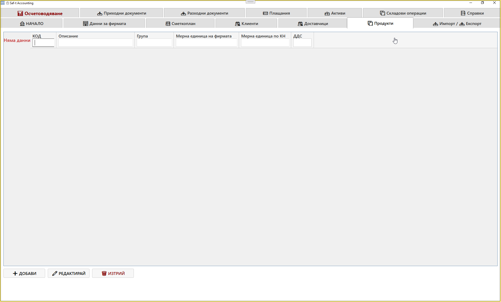
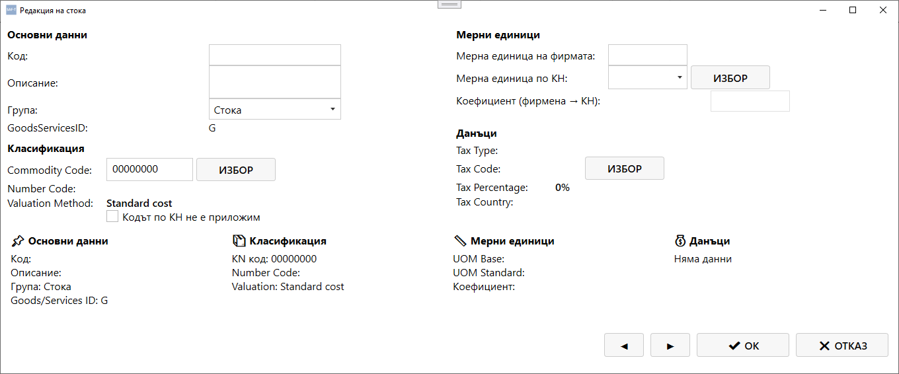
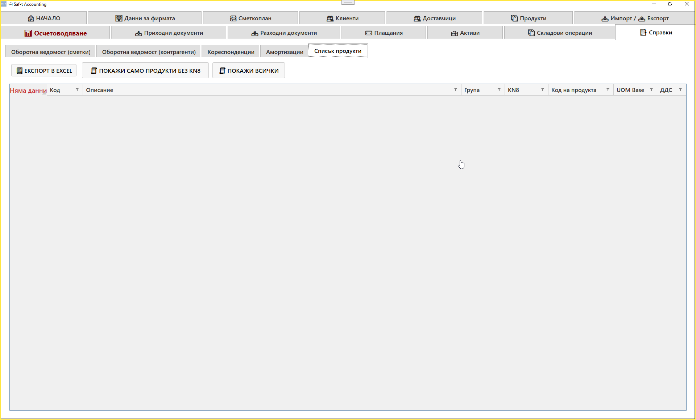

# Таб: Продукти

Табът **Продукти** служи за управление на всички артикули, стоки и услуги, използвани в системата Saf‑t Accounting.  
Тук се въвеждат, редактират и изтриват записи за продукти, които участват в документи, складови операции и справки.

### 📸 Screenshot — Списък продукти
{.zoomable}

### 📸 Screenshot — Редакция на продукт
{.zoomable}

### 📸 Screenshot — Справка продукти
{.zoomable}

---

## 🧭 Навигация и контекст

Табът **Продукти** е достъпен като отделен модул от главния екран на Saf‑t Accounting.  
Той съдържа таблица с всички продукти, регистрирани в системата, независимо дали са стоки, услуги или активи.

---

## 🧩 Основна структура

Екранът съдържа таблица със следните колони:

| Колона | Описание |
|--------|-----------|
| **Код** | Уникален идентификатор на продукта |
| **Описание** | Наименование на продукта или услугата |
| **Група** | Категория (стока, услуга, актив и др.) |
| **Мерна единица на фирмата** | Единица мярка, използвана вътрешно (бр., кг, л и др.) |
| **Мерна единица по КН** | Единица мярка според митническата номенклатура |
| **ДДС** | Данъчна ставка, приложима за продукта |

---

## ⚙️ Основни действия

В долната част на екрана се намират основните команди:

- **➕ Добави** – създава нов запис за продукт  
- **✏️ Редактирай** – отваря избрания продукт за корекция  
- **🗑️ Изтрий** – премахва избрания продукт от базата  

---

## 🔄 Логика на работа

1. При натискане на **Добави** се отваря форма за въвеждане на нов продукт  
2. Попълват се данните за код, описание, група, мерни единици и ДДС  
3. След запис продуктът се появява в таблицата  
4. При нужда може да се редактира или изтрие  
5. Продуктите се използват при създаване на документи, складови операции и справки

---

## 🧮 Връзка с други модули

- **Приходни / Разходни документи** – използват продуктите при фактуриране  
- **Складови операции** – свързват продуктите с движения между складове  
- **Справки** – показват обороти и наличности по продукти  
- **Импорт / Експорт** – позволява експортиране на продуктови данни към Excel или SAF‑T формат

---

## 📌 Обобщение

Табът **Продукти** е основният инструмент за управление на артикулите и услугите в Saf‑t Accounting.  
Той осигурява:

- централизирано управление на всички продукти  
- връзка между документи, складови операции и справки  
- контрол върху данъчните ставки и мерните единици  

Това е ключов модул за поддържане на точна и актуална продуктова база.
