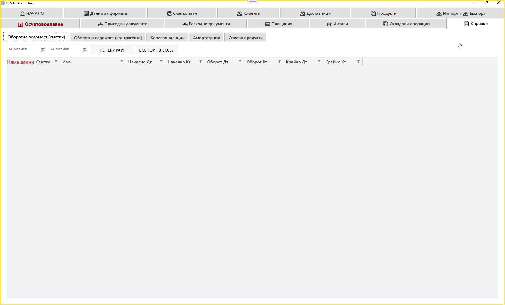
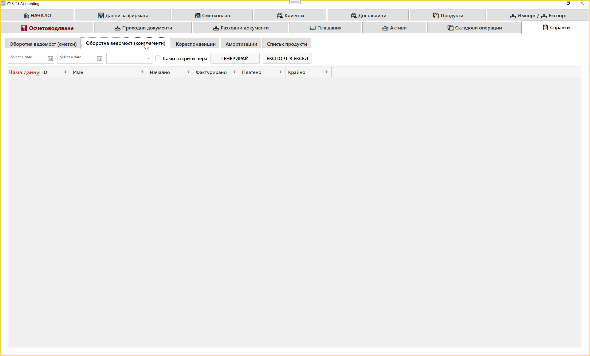

# Таб: Справки

Табът **Справки** е аналитичният модул на SAFTViewer, който предоставя различни счетоводни и финансови отчети.  
Тук потребителят може да генерира оборотни ведомости, кореспонденции, амортизации и списъци с продукти, както и да експортира данните към Excel.

---

## 🧭 Навигация и контекст

Табът **Справки** съдържа няколко подтабове, всеки от които показва различен тип отчет:

1. **Оборотна ведомост (сметки)**  
2. **Оборотна ведомост (контрагенти)**  
3. **Кореспонденции**  
4. **Амортизации**  
5. **Списък продукти**

---

## 📊 1. Оборотна ведомост (сметки)

Тази справка показва оборотите по счетоводните сметки за избран период.

| Колона | Описание |
|--------|-----------|
| **Сметка** | Номер на счетоводната сметка |
| **Име** | Наименование на сметката |
| **Начално Дт / Кт** | Начални дебитни и кредитни салда |
| **Оборот Дт / Кт** | Обороти за периода |
| **Крайно Дт / Кт** | Крайни салда |

Бутони:
- **ГЕНЕРИРАЙ** – зарежда данните за избрания период  
- **ЕКСПОРТ В ЕКСЕЛ** – експортира справката в Excel формат  

---

## 📈 2. Оборотна ведомост (контрагенти)

Показва оборотите по контрагенти (клиенти и доставчици) за избран период.

| Колона | Описание |
|--------|-----------|
| **ID** | Идентификатор на контрагента |
| **Име** | Наименование на контрагента |
| **Начално** | Начално салдо |
| **Фактурирано** | Сума по издадени фактури |
| **Платено** | Сума по извършени плащания |
| **Крайно** | Крайно салдо |

Допълнителни опции:
- **Само открити пера** – показва само контрагенти с неприключени операции  
- **ГЕНЕРИРАЙ / ЕКСПОРТ В ЕКСЕЛ** – зареждане и експортиране на данните  

---

## 🔄 3. Кореспонденции

Показва кореспонденциите между счетоводни сметки за избран период.

| Колона | Описание |
|--------|-----------|
| **Кореспондираща сметка** | Сметка, свързана с избраната |
| **Дебит** | Сума по дебит |
| **Кредит** | Сума по кредит |

Функции:
- Избор на сметка чрез поле **„ИЗБОР НА СМЕТКА“**  
- Задаване на период чрез **„От дата“ / „До дата“**  
- Бутони: **ЗАРЕДИ**, **ЕКСПОРТ В EXCEL**  
- Пагинация за преглед на резултатите  

---

## 🧮 4. Амортизации

Показва справка за амортизацията на активите за избран период.

| Колона | Описание |
|--------|-----------|
| **Номер Актив** | Идентификатор на актива |
| **Описание** | Наименование на актива |
| **Дата на придобиване** | Дата на въвеждане в употреба |
| **Първоначална стойност** | Стойност при придобиване |
| **Набрана амортизация (начало)** | Натрупана амортизация към началото на периода |
| **Амортизация за периода** | Изчислена амортизация за избрания период |
| **Крайна стойност (SAP)** | Остатъчна стойност |
| **SAP норма % / SAP стойност** | Параметри за SAP изчисления |

Бутони:
- **ЗАРЕДИ** – зарежда данните за периода  
- **ЕКСПОРТ В EXCEL** – експортира справката  

---

## 📦 5. Списък продукти

Показва всички продукти и услуги, регистрирани в системата.

| Колона | Описание |
|--------|-----------|
| **Код** | Вътрешен код на продукта |
| **Описание** | Наименование на продукта или услугата |
| **Група** | Категория (стока, услуга и др.) |
| **KN8** | Код по митническата номенклатура |
| **Код на продукта** | Вътрешен идентификатор |
| **UOM Base** | Единица мярка |
| **ДДС** | Данъчна ставка |

Бутони:
- **ЕКСПОРТ В EXCEL** – експортира списъка  
- **ПОКАЖИ САМО ПРОДУКТИ БЕЗ KN8** – филтрира продукти без код  
- **ПОКАЖИ ВСИЧКИ** – показва всички записи  

---

## 📌 Обобщение

Табът **Справки** осигурява пълен достъп до аналитичните данни на фирмата.  
Той позволява:

- Генериране на оборотни ведомости по сметки и контрагенти  
- Проследяване на кореспонденции между сметки  
- Изчисляване на амортизации  
- Преглед на продуктови списъци  
- Експорт на всички справки в Excel формат  

Това е основният модул за анализ и отчетност в SAFTViewer.

