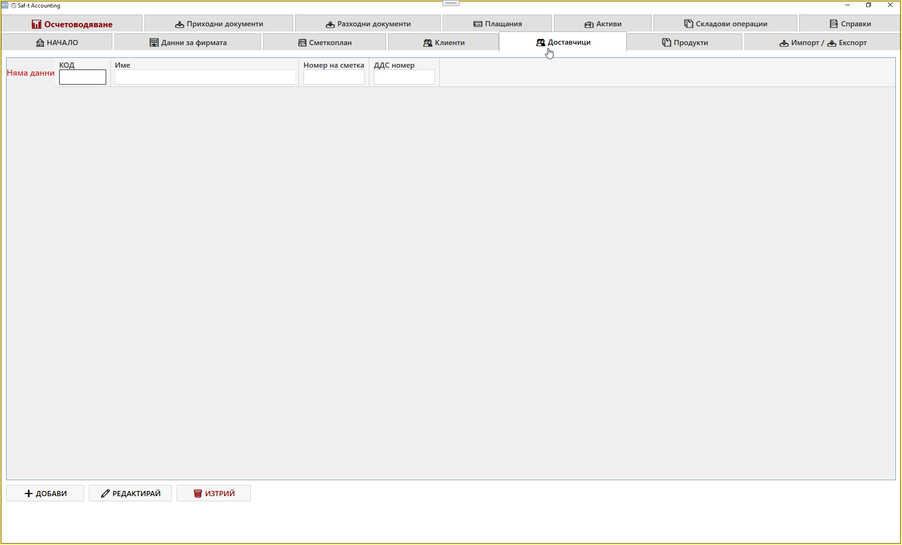
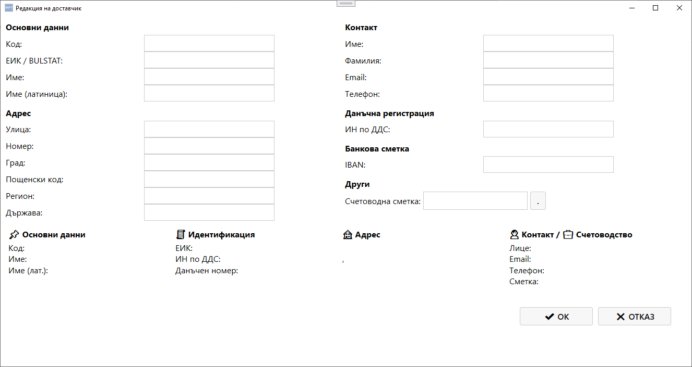

# Таб: Доставчици

Табът **Доставчици** служи за управление на всички доставчици на фирмата.  
Тук се въвеждат, редактират и изтриват записи за контрагенти, които издават фактури или получават плащания.

---

## 🧭 Навигация и контекст

Табът **Доставчици** е достъпен като отделен модул от главния екран на SAFTViewer.  
Той съдържа таблица с всички доставчици, регистрирани в системата.

---

## 🧩 Основна структура

Екранът съдържа таблица със следните колони:

| Колона | Описание |
|--------|-----------|
| **Код** | Уникален идентификатор на доставчика |
| **Име** | Наименование на доставчика |
| **Номер на сметка** | Счетоводна сметка, свързана с доставчика |
| **ДДС номер** | VAT номер на доставчика |

---

## ⚙️ Основни действия

В долната част на екрана се намират основните команди:

- **➕ Добави** – създава нов запис за доставчик  
- **✏️ Редактирай** – отваря избрания доставчик за корекция  
- **🗑️ Изтрий** – премахва избрания доставчик от базата  

---

## 🔄 Логика на работа

1. При натискане на **Добави** се отваря форма за въвеждане на нов доставчик.  
2. Попълват се данните за код, име, сметка и ДДС номер.  
3. След запис доставчикът се появява в таблицата.  
4. При нужда може да се редактира или изтрие.  
5. Доставчиците се използват при създаване на разходни документи и плащания.

---

## 🧮 Връзка с други модули

- **Разходни документи** – използва доставчиците при въвеждане на фактури за покупки.  
- **Плащания** – свързва плащанията с конкретен доставчик.  
- **Справки** – показва оборотите и салдата по доставчици.  
- **Импорт / Експорт** – позволява експортиране на доставчици към Excel или SAF‑T формат.

---

## 📌 Обобщение

Табът **Доставчици** осигурява централизирано управление на всички контрагенти, които издават фактури и получават плащания.  
Той предоставя:

- лесно добавяне и редактиране на доставчици  
- връзка със счетоводните сметки  
- интеграция с разходни документи и справки  

Това е основен модул за работа с доставчици в SAFTViewer.

