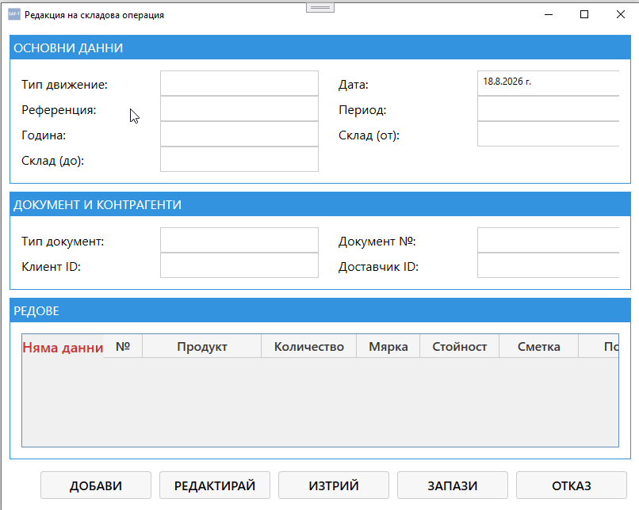

# Екран: Редакция на складова операция

Екранът **„Редакция на складова операция“** позволява преглед и промяна на данните за конкретно движение на стоки между складове от таба **„Складови операции“**.  
Той съдържа всички основни, документни и редови параметри, необходими за правилното осчетоводяване и проследяване на движението на материалите.{.zoomable}
---

## 🧭 Навигация и контекст

Екранът се отваря при избор на команда **„Редактирай“** от таба **Складови операции**.  
Позволява редакция на вече съществуваща операция или преглед на нейните данни.

---

## 🧩 Основна структура

### **1. Основни данни**

| Поле | Описание |
|------|-----------|
| **Тип движение** | Вид на операцията (доставка, прехвърляне, изписване и др.) |
| **Референция** | Уникален идентификатор или номер на операцията |
| **Година** | Отчетна година |
| **Склад (до)** | Целеви склад, в който се получават стоките |
| **Дата** | Дата на операцията |
| **Период** | Отчетен месец или период |
| **Склад (от)** | Изходен склад, от който се изписват стоките |

---

### **2. Документ и контрагенти**

| Поле | Описание |
|------|-----------|
| **Тип документ** | Вид документ, свързан с операцията (фактура, протокол, заявка и др.) |
| **Документ №** | Номер на документа |
| **Клиент ID** | Идентификатор на клиента (ако операцията е продажба) |
| **Доставчик ID** | Идентификатор на доставчика (ако операцията е доставка) |

---

### **3. Редове**

Тази секция съдържа таблица с всички редове (позиции) в операцията.

| Колона | Описание |
|---------|-----------|
| **№** | Пореден номер на реда |
| **Продукт** | Код или наименование на продукта |
| **Количество** | Брой или количество |
| **Мярка** | Мерна единица (бр., кг, л и др.) |
| **Стойност** | Стойност на реда |
| **Сметка** | Счетоводна сметка, към която се осчетоводява движението |
| **Поръчка** | Връзка с конкретна поръчка, ако е приложимо |

**Бутони:**
- **➕ Добави** – добавя нов ред към операцията.  
- **✏️ Редактирай** – отваря избрания ред за корекция.  
- **🗑️ Изтрий** – премахва избрания ред от таблицата.  
- **💾 Запази** – записва промените.  
- **✖ Отказ** – отменя промените и затваря прозореца.

---

## ⚙️ Основни действия

| Бутон | Действие |
|-------|-----------|
| **Добави** | Създава нов ред в операцията |
| **Редактирай** | Позволява промяна на избран ред |
| **Изтрий** | Премахва ред от операцията |
| **Запази** | Потвърждава редакцията и записва данните |
| **Отказ** | Отменя промените и затваря прозореца |

---

## 🔄 Логика на работа

1. При отваряне на екрана се зареждат текущите данни за избраната операция.  
2. Потребителят може да редактира основните полета, документните данни и редовете.  
3. При натискане на **Запази** промените се съхраняват в базата данни.  
4. При **Отказ** промените се игнорират.  
5. Данните се обновяват автоматично в таба **Складови операции**.  
6. Ако операцията е свързана с документ, системата автоматично актуализира съответните записи.

---

## 📌 Обобщение

Екранът **„Редакция на складова операция“** е основният инструмент за управление на движението на стоки и материали в Saf‑t Accounting.  
Той осигурява:

- пълен контрол върху складовите операции  
- връзка с документи и контрагенти  
- автоматично осчетоводяване по сметки  
- визуално групиране на редовете и стойностите  

Това е ключов вътрешен екран за управление на материалните потоци в системата.
